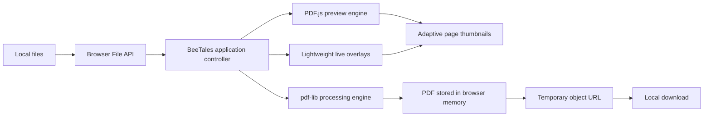

# BeeTales PDF Tools

BeeTales PDF Tools is a free, open-source PDF toolkit that runs entirely in the browser. It helps people organize, split, create, number, watermark, and sign PDF files without uploading their documents to a server.

> **Your files never leave this device.**
>
> No uploads, accounts, cookies, analytics, or remote conversion service.

## Features

| Category | Tool | Description |
| --- | --- | --- |
| Organize | Merge PDFs | Combine multiple PDF files into a single document. |
| Organize | Reorder pages | Arrange pages visually with drag and drop or explicit move controls. |
| Organize | Accessible reordering | Move PDF pages and source images earlier or later with keyboard-friendly controls. |
| Organize | Rotate pages | Rotate individual pages left or right. |
| Organize | Remove pages | Delete unwanted pages before creating the result. |
| Split | Extract pages | Create a new PDF from ranges such as `1-3, 5, 8`. |
| Split | Remove selected pages | Keep the original document except for the selected pages. |
| Split | Split pages | Export selected pages as individual PDF files. |
| Create | Images to PDF | Convert ordered JPG and PNG images into one PDF. |
| Create | Page sizing | Fit images to their natural size, A4, or Letter pages. |
| Create | Image margins | Create pages with no margin, a small margin, or a large margin. |
| Mark | Page numbers | Add page numbers in several header and footer positions. |
| Mark | Watermarks | Add diagonal text at the top, center, bottom, or across the full page. |
| Mark | Watermark styling | Choose watermark text, size, opacity, and color. |
| Sign | Image signature | Place a PNG or JPG signature on one page or every page. |
| Sign | Proportional signature sizing | Choose Small (18%), Medium (26%), or Large (34%) relative to each PDF page. |
| Sign | Automatic signature limits | Keep wide, square, and vertical images inside safe page boundaries. |
| Preview | High-resolution thumbnails | Render clear PDF previews using adaptive device-pixel density. |
| Preview | Live stamp preview | See page numbers, watermark styling, placement, patterns, and signatures directly on the thumbnails. |
| Preview | Lightweight overlays | Update previews without rebuilding the PDF or rendering its pages again. |
| Reliability | Safe page ranges | Reject invalid or excessively large ranges before expanding them. |
| Reliability | Protected processing state | Prevent mode changes or resets while a PDF result is being generated. |

## How It Works

1. The user selects PDF or image files from their device.
2. The browser reads the selected files through the local File API.
3. PDF.js renders adaptive high-resolution page previews without sending the document anywhere.
4. The user chooses pages, order, rotation, watermark settings, or signature placement.
5. Lightweight HTML/CSS overlays display page numbers, watermarks, patterns, and signatures immediately on the thumbnails.
6. Signature dimensions are calculated relative to each page, with automatic width and height limits.
7. `pdf-lib` creates or modifies the PDF in browser memory.
8. The finished document becomes a temporary local object URL.
9. The browser downloads the result directly to the user's device.
10. Temporary data is released when files are cleared, replaced, reset, or the browser tab is closed.

No document content is transmitted to BeeTales, GitHub, or a third-party conversion provider.

## Architecture



### Application layers

| Layer | Files | Responsibility |
| --- | --- | --- |
| Interface | `index.html`, `style.css`, `theme.css` | Tool selection, responsive layout, accessibility labels, page controls, result downloads, and the BeeTales swamp-green design system. |
| Application | `app.js` | File handling, adaptive previews, live overlays, drag and drop, cancellation, state management, validation, and user feedback. |
| PDF operations | `core.mjs` | Safe page ranges, copying, rotation, splitting, numbering, watermark placement, and proportional signature sizing. |
| Rendering | `vendor/pdfjs/` | Local high-resolution PDF page rendering and thumbnail generation. |
| PDF creation | `vendor/pdf-lib/` | Local PDF creation and modification. |
| Brand assets | `assets/`, `favicon.ico`, `favicon.png` | BeeTales identity, mascot, logo, and browser icons. |
| Verification | `test/` | Automated checks for ranges, rotation, splitting, numbering, watermark behavior, and signature sizing. |

### Repository structure

```text
BeeTales-PDF-Tools/
|-- index.html
|-- style.css
|-- theme.css
|-- app.js
|-- core.mjs
|-- favicon.ico
|-- favicon.png
|-- assets/
|   |-- beetales-logo-v2.png
|   |-- sora-avatar.png
|   `-- swamp-space.png
|-- vendor/
|   |-- pdf-lib/
|   `-- pdfjs/
|-- test/
|   `-- core.test.mjs
|-- LICENSE
`-- README.md
```

## Privacy by Design

| Privacy property | Implementation |
| --- | --- |
| No uploads | Files are read and processed only by the browser on the current device. |
| No backend | The application has no document-processing server or database. |
| No accounts | All tools are available without registration or authentication. |
| No tracking | The project includes no analytics, advertising, or tracking scripts. |
| No cookies | The application does not create or require cookies. |
| No runtime CDN | PDF libraries are included in the repository and loaded locally. |
| Temporary results | Downloads use browser object URLs instead of permanent cloud storage. |
| Temporary signature previews | Local signature image URLs are revoked when replaced or reset. |

## Technology

| Technology | Purpose |
| --- | --- |
| HTML5 | Semantic structure, file inputs, forms, and accessible controls. |
| CSS | Responsive desktop/mobile layouts plus a maintainable forest-green, cream, and amber BeeTales brand theme. |
| JavaScript modules | Local application state and browser-side processing. |
| [pdf-lib](https://github.com/Hopding/pdf-lib) | Create, copy, modify, number, watermark, and sign PDF documents. |
| [PDF.js](https://github.com/mozilla/pdf.js) | Render local PDF page previews. |
| Browser File and Blob APIs | Read input files and create temporary local downloads. |

## Reliability and Performance

| Protection | Behavior |
| --- | --- |
| Range validation | Page ranges are checked against the document before pages are expanded or copied. |
| Invalid file handling | Unsupported files produce a controlled message instead of an unhandled browser error. |
| Load cancellation | Previous PDF.js loading tasks are cancelled when files or tools change. |
| Stale-result protection | Older asynchronous operations cannot replace the current workspace state. |
| Incremental thumbnail updates | Rotating one page updates only its canvas; reordering pages reuses existing thumbnails. |
| Processing lock | File, reset, and mode controls are temporarily locked while producing a result. |
| Adaptive rendering | Thumbnail resolution accounts for device pixel density while using capped render dimensions. |
| Signature constraints | Signature width is page-relative, capped at 260 PDF points, and limited to 34% of page height. |
| Cache-safe releases | Versioned application and stylesheet URLs prevent browsers from using stale preview code. |

## Live Preview Behavior

Live previews are available in **Number, mark & sign** mode.

| Preview | Live controls |
| --- | --- |
| Page numbers | Starting number and header/footer position. |
| Watermarks | Text, top/center/bottom placement, full-page pattern, size, color, and opacity. |
| Signatures | Selected image, target page, all-pages option, position, and proportional size. |

Preview layers are visual guides and do not alter the source document. Watermark contrast is enhanced slightly on small thumbnails so light marks remain visible; the exported PDF always uses the exact selected opacity.

## Quality Verification

The automated suite currently covers nine core behaviors:

1. Page-range parsing, duplicate removal, reversed ranges, and oversized-range rejection.
2. Immutable item reordering and boundary handling.
3. Watermark color conversion.
4. Top, center, and bottom watermark placement.
5. Automatic fitting for tall signature images.
6. Proportional signature sizing and maximum-width limits.
7. Page copying, reordering, and rotation.
8. Page-number generation.
9. Splitting selected pages into independent PDF documents.

## Supported Browsers

BeeTales PDF Tools is designed for current versions of:

| Browser | Support |
| --- | --- |
| Google Chrome | Supported |
| Microsoft Edge | Supported |
| Mozilla Firefox | Supported |
| Apple Safari | Supported |

JavaScript modules, Web Workers, the File API, and Blob URLs must be enabled.

## Known Limitations

- Password-protected or encrypted PDF files are not supported.
- Very large documents may require substantial memory because all processing happens locally.
- Existing images embedded inside arbitrary PDFs are not recompressed in the current release.
- Signatures are placed as images and do not create cryptographic digital signatures.
- Browser download settings may require confirmation when splitting many pages into separate files.
- Complex or damaged PDF files may not render identically in every browser.

## Project Principles

- **Private:** documents remain on the user's device.
- **Simple:** tools use clear language and visual page controls.
- **Accessible:** core features do not require an account, subscription, or technical experience.
- **Portable:** the application is static and does not depend on a conversion backend.
- **Open source:** the code can be inspected, improved, and shared under the MIT License.

## License

BeeTales PDF Tools is released under the [MIT License](LICENSE).

Copyright (c) 2026 [Sorairei](https://github.com/Sorairei).
